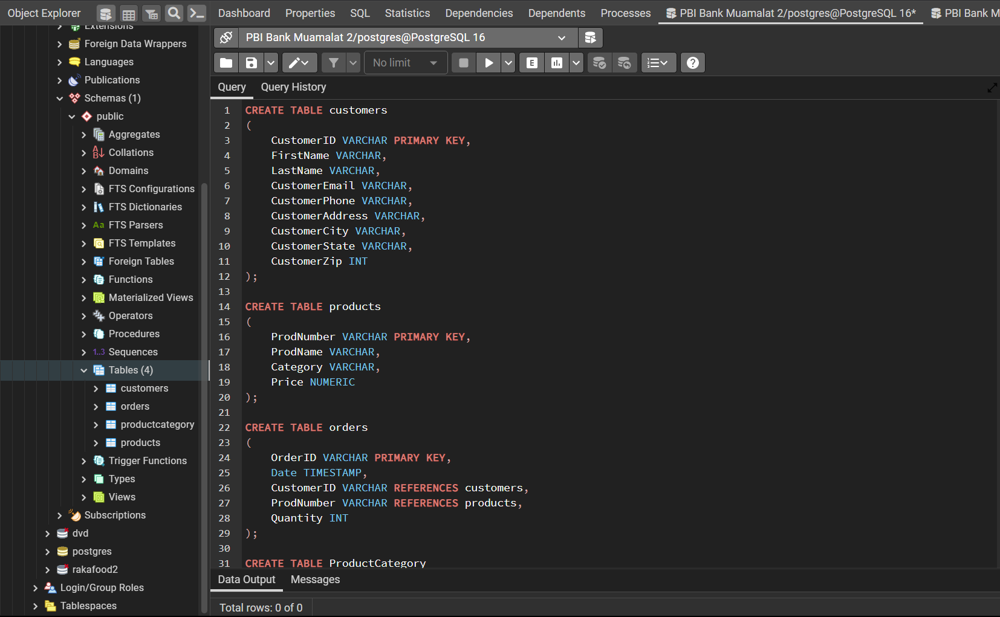

# **Sales Data Analysis**
#### Virtual Internship Experience : Bank Muamalat – Business Intelligence Analyst
#### Author : Althaaf Athaayaa Daffa Qushayyizidane

 
 

## **Case Study**

- #### Determine the respective primary keys in the 4 sales datasets.

- #### Determining the relationship of the 4 tables.

- #### As a BI Analyst, we are asked to create a master table.

- #### From the results of the previously created master table, save the results in CSV format. Then create a visualization that displays the sales data using Looker Studio.

- #### As a BI analyst, what can you suggest to maintain or increase sales with the existing transaction detail table?
 
 
 

# **Getting Started**

## **Determine the respective primary keys in the 4 sales datasets**

- #### Create a table using a query and determine the data types, primary key, and foreign key.
- #### The result of the query after running (4 tables are formed)

 
 
 

## **Determining the relationship of the 4 tables**

- #### Table customers memiliki Primary Key customerid
- #### Table products memiliki Primary Key prodnumber
- #### Table orders memiliki Primary Key ordered serta Foreign Key customerid dan prodnumber.

 
 
 

## **As a BI Analyst, we are asked to create a master table**

- #### Create a Master Table using a query.
- #### The result of the query when executed (produces the master table).
- #### After the master table is formed, we save it in CSV format.

 
 
 

## **Create a visualization that displays the sales data using Looker Studio** --> [Dashboard](https://lookerstudio.google.com/reporting/b99fe8d4-4fa6-44bd-a2be-fe381f8642de)

 
 
 

## **As a BI analyst, what can you suggest to maintain or increase sales with the existing transaction detail table?**

#### `Meningkatkan penjualan produk kategori Robots`: Berdasarkan grafik, produk kategori robots memiliki penjualan tertinggi dan jumlah terjual terbanyak di antara produk lainnya. Produk ini juga menunjukkan tren peningkatan penjualan dan jumlah terjual sepanjang waktu. Oleh karena itu, saya menyarankan untuk memaksimalkan penjualan produk ini dengan cara meningkatkan promosi, memberikan diskon, atau menawarkan paket bundling dengan produk lain.
 

#### `Memanfaatkan pasar potensial di kota Washington`: Kota Washington memiliki populasi yang besar, pendapatan per kapita yang tinggi, dan permintaan yang tinggi terhadap produk-produk teknologi. Oleh karena itu, saya menyarankan untuk memanfaatkan pasar potensial ini dengan cara meningkatkan distribusi, promosi, dan pelayanan di kota Washington. Hal ini dapat meningkatkan loyalitas pelanggan, merebut pangsa pasar, dan meningkatkan keuntungan.
 

#### `Menyelidiki faktor-faktor yang mempengaruhi penjualan di kota Washington serta Mengadaptasi strategi bisnis di kota Washington ke kota-kota lainnya` : Jika faktor-faktor internal yang mempengaruhi penjualan di kota Washington dapat diidentifikasi, maka strategi bisnis yang berhasil di kota Washington dapat diadaptasi ke kota-kota lainnya yang memiliki karakteristik pasar yang serupa. Misalnya, jika produk kategori drone menjadi produk unggulan di kota Washington, maka produk ini dapat dipasarkan lebih agresif di kota-kota lainnya yang memiliki minat yang tinggi terhadap produk ini. Hal ini dapat meningkatkan penjualan dan pangsa pasar di kota-kota lainnya.

